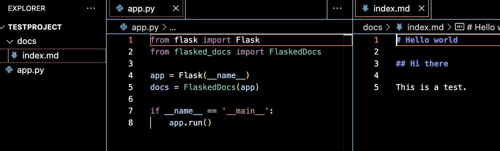
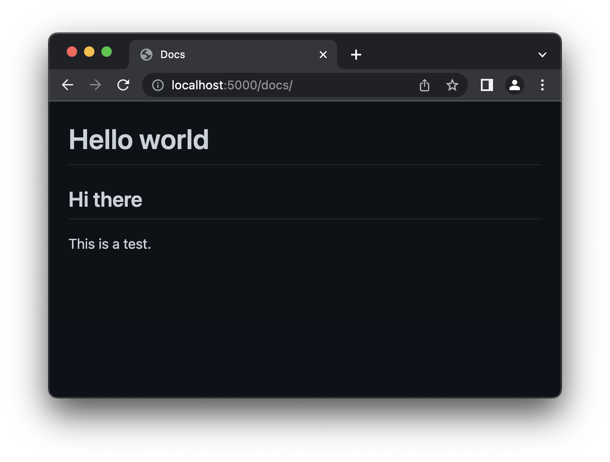

# Flasked-Docs

Flasked-Docs is a markdown documentation renderer for Flask applications. Simply by pointing the extension to a folder of markdown files, Flasked-Docs will take care of handling the routes and rendering the markdown files to HTML.

Turn this:

... into this:


## Installation
```bash
pip install git+https://github.com/koenvaneijk/flasked-docs.git@main
```

## Usage
Assuming you have a folder of markdown files in the `docs` directory, you can simply add the extension to your Flask application and point it to the directory. Name one of your markdown file `index.md` to have them be the index page for their respective section. 

```python
from flask import Flask
from flasked_docs import FlaskedDocs

app = Flask(__name__)
docs = FlaskedDocs(app)

if __name__ == '__main__':
    app.run()
```

Run your app and navigate to `/docs` to see your documentation. You can also add subfolders to organize your documentation, for example `docs/api/index.md` will be the index page for the API section and available at `/docs/api`.

## Configuration
The following configuration options are available:

| Option | Description | Default |
|--------|-------------|---------|
| `path` | The path to the directory containing your markdown files. | `docs` |
| `prefix` | The prefix to use for the documentation site. | `/docs` |
| `template` | The template to use for the documentation site. | `flasked_docs/docs.html` |

## Examples
You can find an example Flask application using Flasked-Docs in the [examples](examples) directory.

## License
Flasked-Docs is licensed under the AGPLv3 license. See the [LICENSE](LICENSE) file for more information.

## Special Thanks

- Sindre Sorhus for his GitHub theme, which is used as the default theme for Flasked Docs and available at https://github.com/sindresorhus/github-markdown-css under the MIT License